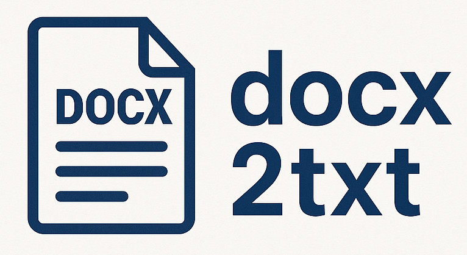

<div align="center">
  
  <p></p>
</div>

**docx2txt** is a small and free C++20 library for converting Microsoft Word documents (`*.docx`) into plain text. It also supports OpenDocument text (`*.odt`), but defaults to Word's Office Open XML when encountering an unknown file extension. 

**docx2txt** uses [miniz](https://github.com/richgel999/miniz) (included as source code) for decompression and [pugixml](https://pugixml.org/) (included as submodule) for parsing.

## Features

- Extracts all text from paragraphs in the main document, including text inside tables and text boxes.
- Does **not** extract text from headers or footers.
- Provides **a single C++ function** with the following signature:

> [!NOTE]
> Text from floating elements like text boxes are inserted at their *anchor positon*, not necessarily where they appear visually.

```C++
namespace docx2txt {

    [[nodiscard]] std::string docx2txt(const std::string& path);

} // namespace docx2txt 
```

Pass the path of your `*.docx` file and the function returns the plain text contained in the file.

If the file cannot be opened, uncompressed, or parsed, the function throws a `std::runtime_error`.

## Example
```C++
#include <docx2txt.hpp>
#include <iostream>

int main() {
    std::cout << docx2txt::docx2txt("path/to/word.docx") << std::endl;
    return 0;
}
```

## Integration
You can integrate **docx2txt** as a static library into your project by adding it as a Git submodule:

```bash
mkdir 3rdparty
cd 3rdparty

git submodule add https://github.com/crawlserv/docx2txt
git submodule update --init --recursive
```
Then, include it in your root `CMakeLists.txt`:
```cmake
add_subdirectory("3rdparty/docx2txt")

target_link_libraries(yourtarget PRIVATE docx2txt)
```
Replace `yourtarget` with the name of your build target.